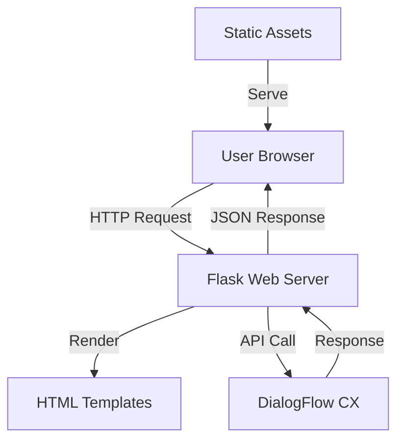

# British Airways Website Clone 🛫✨


## 📋 Project Overview

This project is a functional clone of the British Airways website with an integrated AI chatbot powered by Google DialogFlow. The application provides users with a comprehensive travel experience interface including flight booking, trip management, travel information, destination exploration, and loyalty program engagement.

### ✨ Key Features

- 🤖 **AI-Powered Chatbot** - Intelligent virtual assistant to answer customer queries
- 🎫 **Booking System** - Flight search and booking interface
- 🧳 **Trip Management** - View and manage existing bookings
- 🗺️ **Destination Explorer** - Browse popular destinations with detailed information
- 👑 **Executive Club** - Loyalty program management
- 📱 **Responsive Design** - Optimized for all devices
- 🎤 **Voice Input** - Speech recognition for chatbot interaction

## 🛠️ Technology Stack

| Category | Technologies |
|----------|--------------|
| **Backend** | Python, Flask, Google Cloud DialogFlow |
| **Frontend** | HTML5, CSS3, JavaScript |
| **External Libraries** | Font Awesome, Google Fonts |
| **Deployment** | Gunicorn |

## 🗂️ Project Structure

```
british-airways/
├── static/                  # Static assets
│   ├── css/                 # CSS stylesheets
│   │   └── styles.css       # Main stylesheet
│   ├── js/                  # JavaScript files
│   │   └── script.js        # Main script file
│   ├── images/              # Image assets (not included in repo)
│   └── uploads/             # User uploaded files
├── templates/               # HTML templates
│   ├── index.html           # Homepage
│   ├── destinations.html    # Destinations page
│   ├── executive-club.html  # Executive Club page
│   ├── my-trips.html        # My Trips page
│   └── travel-information.html  # Travel Information page
├── .gitignore               # Git ignore file
├── dialogflow_api.py        # DialogFlow integration
├── main.py                  # Flask application
├── README.md                # Project documentation
└── requirements.txt         # Python dependencies
```

## 🚀 Setup & Installation

### Prerequisites

- Python 3.8+
- Google Cloud account with DialogFlow CX enabled
- Google Cloud API credentials

### Installation Steps

1. **Clone the repository**
   ```bash
   git clone https://github.com/yourusername/british-airways.git
   cd british-airways
   ```

2. **Create and activate a virtual environment**
   ```bash
   python -m venv venv
   source venv/bin/activate  # On Windows: venv\Scripts\activate
   ```

3. **Install dependencies**
   ```bash
   pip install -r requirements.txt
   ```

4. **Set up Google Cloud credentials**
   - Create a service account key in Google Cloud Console
   - Download the JSON key file
   - Set the environment variable:
   ```bash
   export GOOGLE_APPLICATION_CREDENTIALS="path/to/your/credentials.json"
   # On Windows: set GOOGLE_APPLICATION_CREDENTIALS=path\to\your\credentials.json
   ```

5. **Run the application**
   ```bash
   python main.py
   ```

6. **Access the website**
   - Open your browser and navigate to: `http://localhost:8080`

## 🔧 DialogFlow Configuration

The chatbot integration requires a properly configured DialogFlow CX agent:

1. Create a DialogFlow CX agent in Google Cloud Console
2. Configure intents for common airline queries:
   - Flight booking assistance
   - Baggage information
   - Check-in procedures
   - Flight status
   - Loyalty program details
3. Update the DialogFlow agent ID in `dialogflow_api.py`:

```python
agent_id = "YOUR_AGENT_ID"
```

## 📱 Features In Detail

### AI Chatbot

The virtual assistant provides immediate support for various customer queries:

- 💬 **Natural Language Processing** - Understands conversational queries
- 🗣️ **Voice Input Support** - Allows speaking directly to the chatbot
- 📎 **File Attachment** - Upload relevant documents during conversation
- ⚡ **Real-time Responses** - Instant answers to common questions

### Booking System

The flight booking interface offers:

- 🔄 **Round-trip/One-way/Multi-city** options
- 📅 **Date selection** with calendar picker
- 👨‍👩‍👧‍👦 **Passenger and class selection**
- 🏨 **Add-on options** for hotels and car rentals

### Travel Information

Comprehensive travel resources including:

- 📄 **Document requirements**
- 🧳 **Baggage allowances**
- ✔️ **Check-in procedures**
- 🛂 **Airport guides**
- 💉 **Health and safety information**

## 🧩 Code Examples

### Flask Route Example

```python
@app.route('/chat', methods=['POST'])
def chat():
    try:
        data = request.json
        if not data:
            return jsonify({"error": "No data received"}), 400

        message = data.get('message', '')
        if not message:
            return jsonify({"error": "No message provided"}), 400
        
        # Send message to Dialogflow and get response
        dialogflow_response = dialogflow_api.run_sample([message], session_id)
        
        if not dialogflow_response or not dialogflow_response[0]:
            return jsonify({"error": "No response from Dialogflow"}), 500

        # Return the response
        return jsonify({"response": dialogflow_response[0]})

    except Exception as e:
        app.logger.error(f"Error in chat endpoint: {str(e)}")
        return jsonify({"error": "Internal server error"}), 500
```

### DialogFlow Integration

```python
def detect_intent_texts(agent, session_id, texts, language_code):
    """Returns the result of detect intent with texts as inputs."""
    session_path = f"{agent}/sessions/{session_id}"
    client_options = None
    agent_components = AgentsClient.parse_agent_path(agent)
    location_id = agent_components["location"]
    
    if location_id != "global":
        api_endpoint = f"{location_id}-dialogflow.googleapis.com:443"
        client_options = {"api_endpoint": api_endpoint}
        
    session_client = SessionsClient(client_options=client_options)

    for text in texts:
        text_input = session.TextInput(text=text)
        query_input = session.QueryInput(text=text_input, language_code=language_code)
        request = session.DetectIntentRequest(
            session=session_path, query_input=query_input
        )
        response = session_client.detect_intent(request=request)
        
        response_messages = [
            " ".join(msg.text.text) for msg in response.query_result.response_messages
        ]
        return response_messages
```

## 📊 System Architecture



## 🔐 Security Considerations

- ✅ Input validation for all form submissions
- ✅ File type restrictions for uploads
- ✅ Maximum file size limits
- ✅ Secure handling of user data
- ✅ CSRF protection via Flask
- ⚠️ Ensure DialogFlow API credentials are properly secured

## 🌐 Deployment

To deploy to production:

1. Set up a production server with Python and required dependencies
2. Configure environment variables for production settings
3. Set up proper logging and monitoring
4. Use Gunicorn as the WSGI HTTP server:

```bash
gunicorn -b 0.0.0.0:8080 main:app
```

## 📈 Future Enhancements

- [ ] 🔒 User authentication system
- [ ] 💳 Payment processing integration
- [ ] 📊 Analytics dashboard
- [ ] 📱 Progressive Web App capabilities
- [ ] 🌍 Multi-language support
- [ ] 🔔 Push notifications

## 👥 Contributing

Contributions are welcome! Please feel free to submit a Pull Request.

1. Fork the repository
2. Create your feature branch (`git checkout -b feature/amazing-feature`)
3. Commit your changes (`git commit -m 'Add some amazing feature'`)
4. Push to the branch (`git push origin feature/amazing-feature`)
5. Open a Pull Request

## 📄 License

This project is licensed under the MIT License - see the LICENSE file for details.

## 🙏 Acknowledgements

- British Airways for UI/UX inspiration
- Google Cloud for DialogFlow CX platform
- Font Awesome for icons
- Open source community for various libraries and tools

---

💡 **Note**: This is a demo project and not affiliated with or endorsed by British Airways.
