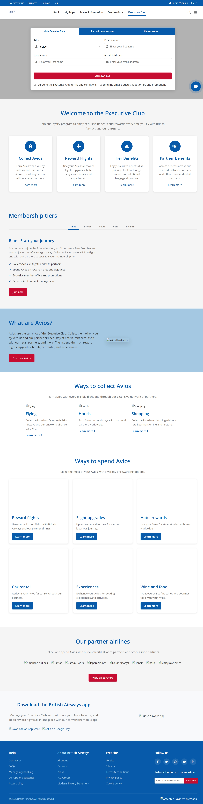
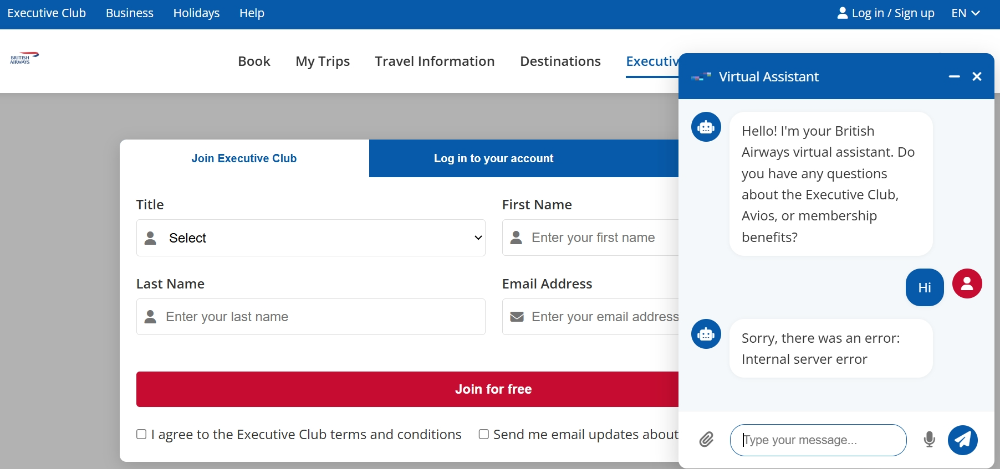
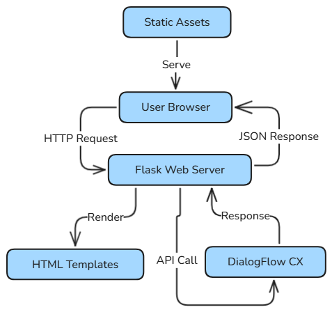
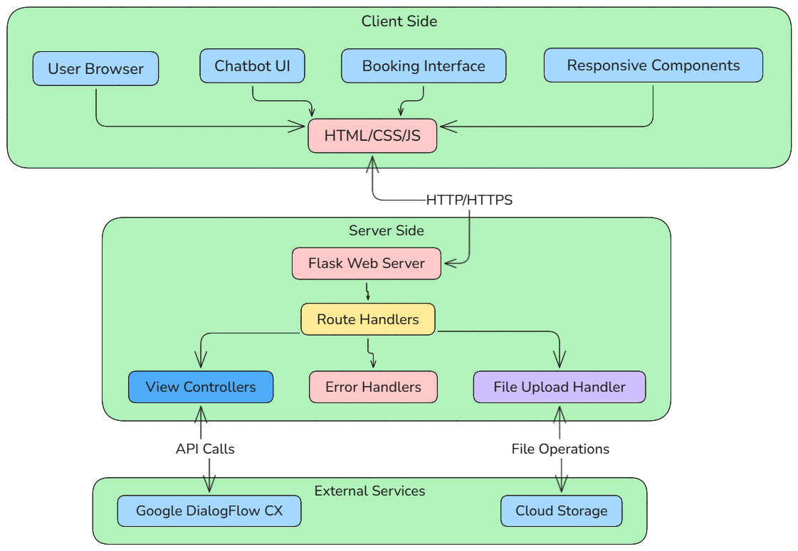
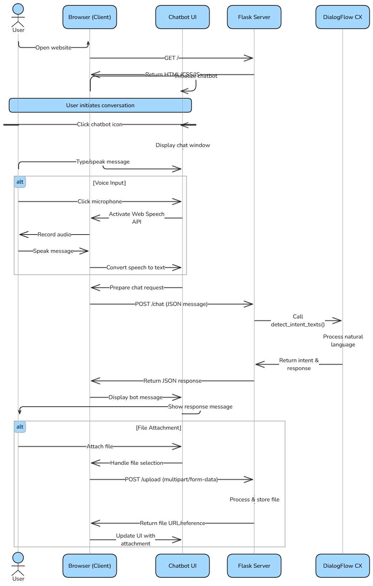

#  Airways Website Clone 🛫✨

## 📸 Screenshots

### Main Website Interface

*The main homepage featuring flight booking interface, navigation menu, and responsive design elements.*

### AI Chatbot Integration

*Interactive AI-powered chatbot with voice input capabilities and file attachment support.*

## 📋 Project Overview

This project is a comprehensive Airways website clone featuring an intelligent AI chatbot powered by Google DialogFlow CX. The application delivers a complete digital airline experience, combining modern web technologies with artificial intelligence to provide users with seamless flight booking, trip management, and customer service capabilities.

### 🎯 Project Goals

- **Digital Transformation**: Modernize airline customer experience through web technologies
- **AI Integration**: Implement conversational AI for enhanced customer support
- **User Experience**: Create intuitive, responsive interfaces for all user interactions
- **Accessibility**: Ensure the platform is accessible across all devices and user capabilities
- **Scalability**: Build a foundation that can grow with business needs

### ✨ Key Features

- 🤖 **AI-Powered Virtual Assistant** - Advanced DialogFlow CX integration with natural language understanding
- 🎫 **Comprehensive Booking System** - Multi-city flight search with dynamic pricing and seat selection
- 🧳 **Intelligent Trip Management** - Real-time booking tracking and modification capabilities
- 🗺️ **Interactive Destination Explorer** - Rich destination content with weather, attractions, and local information
- 👑 **Executive Club Integration** - Tier-based loyalty program with benefits tracking
- 📱 **Progressive Web Design** - Mobile-first responsive design with offline capabilities
- 🎤 **Advanced Voice Interface** - Speech recognition and synthesis for hands-free interaction
- 📎 **Smart File Handling** - Document upload and processing for travel requirements
- 🔒 **Enterprise Security** - Multi-layer security with data encryption and privacy protection

## 🛠️ Technology Stack

### Backend Technologies
| Component | Technology | Purpose |
|-----------|------------|---------|
| **Web Framework** | Python Flask | Lightweight, flexible web application framework |
| **AI Platform** | Google Cloud DialogFlow CX | Advanced conversational AI with natural language processing |
| **Session Management** | Flask Sessions | User session handling and state management |
| **File Processing** | Python OS, UUID | Secure file upload and unique identifier generation |
| **Logging** | Python Logging | Application monitoring and debugging |

### Frontend Technologies
| Component | Technology | Purpose |
|-----------|------------|---------|
| **Markup** | HTML5 | Semantic structure and accessibility |
| **Styling** | CSS3 | Modern responsive design with grid and flexbox |
| **Interactivity** | Vanilla JavaScript | Dynamic user interactions and API communication |
| **Speech API** | Web Speech API | Voice recognition and text-to-speech synthesis |
| **Icons** | Font Awesome | Professional iconography and visual elements |
| **Typography** | Google Fonts | Custom typography for brand consistency |

### Infrastructure & Deployment
| Component | Technology | Purpose |
|-----------|------------|---------|
| **WSGI Server** | Gunicorn | Production-ready Python web server |
| **Cloud Platform** | Google Cloud Platform | AI services and scalable infrastructure |
| **Version Control** | Git | Source code management and collaboration |

## 🗂️ Project Structure

```
bria-airways/
├── 📁 static/                      # Static assets and resources
│   ├── 📁 css/                     # Stylesheets and design assets
│   │   └── 📄 styles.css           # Main application stylesheet
│   ├── 📁 js/                      # JavaScript modules and scripts
│   │   ├── 📄 script.js            # Main application logic
│   │   └── 📄 speech-synthesis.js  # Voice interface handling
│   ├── 📁 images/                  # Static images and graphics
│   └── 📁 uploads/                 # User-uploaded files storage
├── 📁 templates/                   # HTML template files
│   ├── 📄 index.html               # Main homepage template
│   ├── 📄 destinations.html        # Destination explorer page
│   ├── 📄 executive-club.html      # Loyalty program interface
│   ├── 📄 my-trips.html            # Trip management dashboard
│   └── 📄 travel-information.html  # Travel resources and guides
├── 📁 Images/                      # Documentation and demo images
│   ├── 🖼️ website.png             # Main website screenshot
│   └── 🖼️ chatbot.png             # Chatbot interface screenshot
├── 📄 main.py                      # Flask web application server
├── 📄 dialogflow_api.py            # Google DialogFlow CX integration
├── 📄 requirements.txt             # Python package dependencies
├── 📄 .gitignore                   # Git version control exclusions
├── 🖼️ image.png                   # System architecture diagram
├── 🖼️ image-1.png                 # Client-server architecture
├── 🖼️ image-2.png                 # Detailed interaction flow
└── 📄 README.md                    # Project documentation (this file)
```

### 📂 Directory Descriptions

#### `/static/` - Frontend Assets
- **CSS Files**: Modern responsive stylesheets with CSS Grid and Flexbox
- **JavaScript Files**: Vanilla JS modules for dynamic functionality
- **Images**: Optimized web graphics and user interface assets
- **Uploads**: Secure temporary storage for user file attachments

#### `/templates/` - HTML Templates
- **Jinja2 Templates**: Server-side rendered HTML with dynamic content
- **Responsive Design**: Mobile-first responsive web design implementation
- **SEO Optimized**: Semantic HTML with proper meta tags and structure
- **Accessibility**: WCAG compliant markup with ARIA attributes

#### Root Directory Files
- **main.py**: Core Flask application with routing and business logic
- **dialogflow_api.py**: AI chatbot integration and conversation management
- **requirements.txt**: Dependency management for consistent deployments
- **Architecture Diagrams**: Visual documentation of system design

## 🤖 Chatbot Capabilities & AI Features

### 🧠 DialogFlow CX Integration

#### Advanced Natural Language Processing
- **Intent Recognition**: Accurately identifies user intentions from natural language input
- **Entity Extraction**: Extracts key information like dates, locations, and preferences
- **Context Management**: Maintains conversation context across multiple interactions
- **Multi-turn Conversations**: Handles complex booking flows and troubleshooting scenarios
- **Sentiment Analysis**: Understands user emotions and adjusts responses accordingly

#### Supported Query Types
- **Flight Bookings**: "Book a flight from New York to London next Friday"
- **Reservation Management**: "Change my seat to a window seat on flight BA123"
- **Baggage Inquiries**: "What's the weight limit for checked baggage to Europe?"
- **Check-in Assistance**: "Help me check in for my flight tomorrow"
- **Flight Status**: "Is flight BA456 on time?"
- **Loyalty Program**: "How many points do I need for a free upgrade?"
- **Travel Requirements**: "Do I need a visa to travel to Japan?"
- **General Support**: "I need help with my booking confirmation"

### 🎤 Voice Interface Technology

#### Speech Recognition Features
- **Real-time Processing**: Instant speech-to-text conversion using Web Speech API
- **Noise Cancellation**: Advanced filtering for clear voice recognition in noisy environments
- **Multi-language Support**: Recognition in multiple languages and accents
- **Confidence Scoring**: Quality assessment of recognized speech for accuracy
- **Continuous Listening**: Hands-free conversation mode for extended interactions

#### Voice Response Capabilities
- **Natural Speech Synthesis**: Human-like text-to-speech with proper intonation
- **Speed Control**: Adjustable speech rate for user preferences
- **Voice Selection**: Multiple voice options for personalization
- **SSML Support**: Speech Synthesis Markup Language for enhanced expression
- **Accessibility**: Screen reader compatibility and audio descriptions

### 📁 File Processing Intelligence

#### Document Understanding
- **Image Analysis**: OCR processing for boarding passes and identification documents
- **Format Support**: PDF, images, text files, and common document formats
- **Data Extraction**: Automatic extraction of relevant information from uploaded files
- **Security Scanning**: Malware detection and file validation before processing
- **Privacy Protection**: Secure handling and automatic deletion of sensitive documents

#### Smart Assistance Features
- **Booking Confirmation Processing**: Extract flight details from confirmation emails
- **Receipt Analysis**: Process expense receipts for corporate travel reporting
- **Document Verification**: Validate passport and identification document requirements
- **Itinerary Creation**: Generate travel schedules from booking confirmations
- **Expense Tracking**: Categorize and organize travel-related expenses

### 🔄 Conversation Flow Management

#### Intelligent Routing
- **Intent Classification**: Route queries to appropriate specialist handlers
- **Escalation Logic**: Seamless handoff to human agents when needed
- **Context Preservation**: Maintain conversation history across channel switches
- **Priority Handling**: Urgent requests receive immediate attention
- **Multi-channel Support**: Consistent experience across web, mobile, and voice interfaces

#### Personalization Engine
- **User Preference Learning**: Adapt responses based on individual user patterns
- **History Integration**: Reference previous conversations and bookings
- **Recommendation System**: Suggest relevant options based on user profile
- **Cultural Adaptation**: Adjust communication style for different cultural contexts
- **Accessibility Customization**: Adapt interface for users with different abilities

### 📊 Analytics & Continuous Improvement

#### Performance Monitoring
- **Response Accuracy**: Track successful query resolution rates
- **User Satisfaction**: Monitor conversation completion and satisfaction scores
- **Performance Metrics**: Response times, session duration, and engagement levels
- **Error Analysis**: Identify and address common conversation failures
- **A/B Testing**: Continuous improvement through response variation testing

#### Machine Learning Enhancement
- **Training Data Collection**: Gather anonymized conversation data for model improvement
- **Intent Discovery**: Identify new user intents for expanded capability
- **Response Optimization**: Improve response quality through feedback analysis
- **Predictive Features**: Anticipate user needs based on behavior patterns
- **Automated Updates**: Regular model updates for improved performance

## 🚀 Setup & Installation

### 📋 Prerequisites

#### System Requirements
- **Operating System**: Windows 10+, macOS 10.15+, or Linux (Ubuntu 18.04+)
- **Python**: Version 3.8 or higher with pip package manager
- **Browser**: Modern web browser with JavaScript and Web Speech API support
- **Memory**: Minimum 4GB RAM for development environment
- **Storage**: At least 1GB free disk space

#### Google Cloud Requirements
- **Google Cloud Account**: Active account with billing enabled
- **DialogFlow CX Access**: API access and appropriate permissions
- **Service Account**: JSON credentials file for authentication
- **API Quotas**: Sufficient DialogFlow CX API quota for expected usage

### 🛠️ Installation Steps

#### 1. Repository Setup
Clone the repository to your local development environment:
- Download or clone the repository files
- Navigate to the project directory
- Verify all required files are present

#### 2. Python Environment Configuration
Create an isolated Python environment to avoid dependency conflicts:
- Create a new virtual environment using Python's built-in venv module
- Activate the virtual environment
- Verify Python version compatibility

#### 3. Dependency Installation
Install all required Python packages:
- Use pip to install packages from requirements.txt
- Verify all dependencies are correctly installed
- Check for any version compatibility issues

#### 4. Google Cloud Authentication Setup
Configure DialogFlow CX access credentials:
- Create a Google Cloud service account
- Download the JSON credentials file
- Set the GOOGLE_APPLICATION_CREDENTIALS environment variable
- Test the authentication connection

#### 5. Application Configuration
Customize the application settings:
- Update DialogFlow agent configuration
- Configure file upload directories
- Set application security parameters
- Verify all configuration values

#### 6. Development Server Launch
Start the Flask development server:
- Run the main application file
- Verify server startup without errors
- Check console output for any warnings

#### 7. Application Access
Access the running application:
- Open a web browser
- Navigate to the local server address
- Test basic functionality
- Verify chatbot integration works

### 🔧 Configuration Options

#### Environment Variables
Set the following environment variables for proper operation:

| Variable | Purpose | Example |
|----------|---------|---------|
| `GOOGLE_APPLICATION_CREDENTIALS` | DialogFlow authentication | `/path/to/credentials.json` |
| `FLASK_ENV` | Development/production mode | `development` or `production` |
| `UPLOAD_FOLDER` | File upload directory | `static/uploads` |
| `MAX_CONTENT_LENGTH` | Maximum file size | `16777216` (16MB) |

#### Application Settings
Customize these settings in the main application file:

- **Upload File Types**: Modify allowed file extensions for security
- **Session Configuration**: Adjust session timeout and security settings
- **Logging Level**: Set appropriate logging verbosity for your environment
- **DialogFlow Settings**: Configure agent ID, location, and language preferences

### 🐛 Troubleshooting

#### Common Issues and Solutions

**DialogFlow Authentication Errors**
- Verify credentials file path is correct
- Check service account permissions
- Ensure DialogFlow CX API is enabled

**Port Already in Use**
- Change the default port in the application
- Stop any conflicting services
- Use netstat to identify port usage

**File Upload Failures**
- Check upload directory permissions
- Verify file size limits
- Ensure allowed file types are configured

**Voice Features Not Working**
- Use HTTPS for production deployment
- Check browser microphone permissions
- Verify Web Speech API support

### 🌐 Development vs Production

#### Development Environment
- Use Flask's built-in development server
- Enable debug mode for detailed error messages
- Use relaxed security settings for testing
- Configure local file storage

#### Production Environment
- Deploy with Gunicorn WSGI server
- Enable production security settings
- Configure cloud-based file storage
- Set up proper logging and monitoring


## 🔧 DialogFlow Configuration

The chatbot integration requires a properly configured DialogFlow CX agent with advanced conversational capabilities:

### Prerequisites Setup
1. **Google Cloud Project**: Create or select an existing Google Cloud project
2. **DialogFlow CX API**: Enable the DialogFlow CX API in your project
3. **Service Account**: Create a service account with DialogFlow CX permissions
4. **Authentication**: Download service account JSON key for authentication

### Agent Configuration
1. **Create DialogFlow CX Agent**: Set up a new agent in your preferred region
2. **Intent Management**: Configure intents for comprehensive airline customer service:
   - **Flight Booking**: Search flights, price inquiries, seat selection assistance
   - **Reservation Management**: Booking modifications, cancellations, confirmations
   - **Baggage Services**: Allowance information, excess baggage, special items
   - **Check-in Support**: Online check-in, boarding passes, seat assignments
   - **Flight Status**: Real-time updates, delays, gate changes
   - **Loyalty Program**: Executive Club benefits, tier status, point redemption
   - **Travel Requirements**: Visa information, health requirements, documentation
   - **Customer Support**: General inquiries, complaints, feedback

3. **Entity Configuration**: Define entities for:
   - Destinations and airports
   - Flight classes and fare types
   - Passenger types and age groups
   - Travel dates and time preferences

4. **Flow Design**: Create conversational flows for complex multi-turn interactions

### Integration Setup
- Update the DialogFlow agent configuration in your environment
- Ensure proper API credentials are configured
- Test the integration with sample queries

## 📱 Features In Detail

### 🤖 AI-Powered Virtual Assistant

The DialogFlow CX-powered chatbot provides enterprise-level conversational AI capabilities:

#### Core Capabilities
- **Natural Language Understanding**: Advanced NLP processes complex, multi-intent queries
- **Context Awareness**: Maintains conversation context across multiple interactions
- **Multi-turn Conversations**: Handles complex booking flows and troubleshooting scenarios
- **Intent Recognition**: Accurately identifies user intentions from varied phrasings
- **Entity Extraction**: Extracts key information like dates, destinations, and preferences

#### Voice Integration
- **Speech Recognition**: Real-time voice-to-text conversion using Web Speech API
- **Voice Response**: Natural text-to-speech synthesis for accessibility
- **Noise Handling**: Robust speech processing in various audio environments
- **Multi-language Support**: Configurable language preferences for global users

#### Smart Features
- **File Upload Processing**: Handle documents like passports, boarding passes, receipts
- **Session Persistence**: Maintain conversation history across browser sessions
- **Fallback Handling**: Graceful degradation when AI confidence is low
- **Error Recovery**: Intelligent retry mechanisms for failed requests

### 🎫 Advanced Booking System

#### Flight Search Engine
- **Multi-city Itineraries**: Complex routing with multiple stops and destinations
- **Flexible Date Search**: Calendar view with price variations across dates
- **Real-time Pricing**: Dynamic fare calculation based on availability and demand
- **Filter Options**: Price range, departure times, airline preferences, stop preferences

#### Passenger Management
- **Group Bookings**: Handle multiple passengers with different requirements
- **Special Assistance**: Wheelchair access, dietary requirements, unaccompanied minors
- **Seat Selection**: Interactive seat maps with real-time availability
- **Passenger Profiles**: Save frequent traveler information for quick bookings

#### Add-on Services
- **Baggage Options**: Extra baggage allowances and special item handling
- **Travel Insurance**: Comprehensive coverage options and policy details
- **Ground Transportation**: Airport transfers, car rentals, hotel bookings
- **Meal Preferences**: Special dietary requirements and premium meal options

### 🧳 Intelligent Trip Management

#### Booking Overview
- **Consolidated Dashboard**: All bookings in a single, organized interface
- **Real-time Updates**: Live flight status, gate changes, and delay notifications
- **Digital Documents**: Boarding passes, e-tickets, and travel confirmations
- **Modification Tools**: Easy rebooking, upgrades, and cancellation options

#### Travel Timeline
- **Journey Visualization**: Timeline view of complete travel itinerary
- **Reminder System**: Automated notifications for check-in, departure, and connections
- **Weather Integration**: Destination weather forecasts and travel advisories
- **Local Information**: Airport guides, transportation options, and local attractions

### 🗺️ Interactive Destination Explorer

#### Destination Discovery
- **Rich Content**: High-quality images, videos, and detailed descriptions
- **Local Insights**: Cultural information, customs, and travel tips
- **Seasonal Recommendations**: Best times to visit based on weather and events
- **Popular Attractions**: Curated lists of must-see destinations and activities

#### Travel Planning Tools
- **Itinerary Builder**: Create and customize multi-day travel plans
- **Budget Estimator**: Cost calculations for accommodations, food, and activities
- **Local Events**: Festivals, concerts, and cultural events calendar
- **Safety Information**: Current safety ratings and travel advisories

### 👑 Executive Club Integration

#### Membership Benefits
- **Tier Tracking**: Real-time status monitoring and tier progression
- **Point Management**: Earn, redeem, and transfer loyalty points
- **Exclusive Offers**: Member-only promotions and upgrade opportunities
- **Priority Services**: Fast-track check-in, boarding, and customer service

#### Personalization
- **Preference Management**: Saved seat preferences, meal choices, and travel habits
- **Tailored Recommendations**: Personalized destination and service suggestions
- **Member Communications**: Exclusive newsletters and benefit updates
- **Partner Benefits**: Integration with hotel, car rental, and credit card partners

## 📊 System Architecture

The Bria Airways application follows a modern three-tier architecture pattern, ensuring separation of concerns, scalability, and maintainability.

### High-Level Architecture Overview

*Basic system flow showing the interaction between client browsers, Flask web server, and external services.*

### Client-Server Architecture

*Detailed view of the client-side components (browser, chatbot UI, booking interface) communicating with server-side components (Flask server, route handlers, external services) via HTTP/HTTPS protocols.*

### Detailed Interaction Flow

*Comprehensive sequence diagram showing the complete user interaction flow from website access through chatbot conversations, voice input processing, file attachments, and DialogFlow integration.*

### Architecture Components

#### 🌐 Presentation Layer (Frontend)
- **User Browser**: Modern web browsers with HTML5, CSS3, and JavaScript support
- **Responsive Interface**: Mobile-first design adapting to various screen sizes
- **Interactive Components**: Dynamic forms, chatbot interface, voice controls
- **Static Assets**: CSS stylesheets, JavaScript modules, images, and fonts

#### ⚙️ Application Layer (Backend)
- **Flask Web Server**: Lightweight Python web framework handling HTTP requests
- **Route Handlers**: RESTful endpoints for different application functionalities
- **Session Management**: User session tracking and state persistence
- **Error Handling**: Comprehensive error management and logging
- **File Processing**: Secure upload and storage of user attachments

#### 🔌 Integration Layer (External Services)
- **Google DialogFlow CX**: AI-powered natural language processing and response generation
- **Cloud Storage**: Secure file storage and retrieval capabilities
- **Speech Services**: Web Speech API for voice recognition and synthesis

#### 🗄️ Data Flow
1. **User Interaction**: Users interact through web browsers with responsive UI
2. **Request Processing**: Flask server processes HTTP requests and routes them appropriately
3. **AI Processing**: Natural language queries are sent to DialogFlow for intent recognition
4. **Response Generation**: AI responses are formatted and returned to the client
5. **Real-time Updates**: Dynamic UI updates provide immediate feedback to users

## 🔐 Security Considerations

The Bria Airways application implements multiple layers of security to protect user data and ensure safe operations.

### 🛡️ Input Validation & Sanitization
- **Form Validation**: Comprehensive server-side validation for all user inputs
- **SQL Injection Prevention**: Parameterized queries and input sanitization
- **XSS Protection**: HTML escaping and content security policies
- **File Upload Security**: Strict file type restrictions and size limitations
- **Data Type Validation**: Ensure all inputs match expected data types and formats

### 🔒 Authentication & Authorization
- **Session Management**: Secure session handling with encrypted session cookies
- **CSRF Protection**: Cross-site request forgery protection via Flask's built-in mechanisms
- **API Authentication**: Secure DialogFlow API credential management
- **User Access Control**: Role-based access control for different user types
- **Password Security**: Industry-standard password hashing and storage (when implemented)

### 🌐 Network Security
- **HTTPS Enforcement**: SSL/TLS encryption for all data transmission
- **CORS Configuration**: Proper cross-origin resource sharing settings
- **Rate Limiting**: API request throttling to prevent abuse
- **Header Security**: Security headers for clickjacking and content type protection
- **Domain Validation**: Ensure requests originate from authorized domains

### 💾 Data Protection
- **Encryption at Rest**: Sensitive data encryption in storage systems
- **Encryption in Transit**: All communications encrypted using modern TLS protocols
- **PII Handling**: Careful handling of personally identifiable information
- **Data Retention**: Appropriate data lifecycle management and deletion policies
- **Backup Security**: Encrypted backups with access controls

### 🔧 Configuration Security
- **Environment Variables**: Sensitive configuration stored in environment variables
- **Credential Management**: Secure storage and rotation of API keys and secrets
- **Debug Mode**: Disabled debug mode in production environments
- **Error Handling**: Prevent information disclosure through error messages
- **Logging Security**: Secure logging practices without sensitive data exposure

### 📊 Monitoring & Auditing
- **Access Logging**: Comprehensive logging of user activities and system events
- **Security Monitoring**: Real-time detection of suspicious activities
- **Error Tracking**: Systematic error monitoring and alerting
- **Performance Monitoring**: System performance tracking and anomaly detection
- **Compliance Reporting**: Generate reports for security compliance requirements

### ⚠️ Security Recommendations

#### For Development
- Never commit credentials or API keys to version control
- Use separate development and production environments
- Regularly update dependencies and scan for vulnerabilities
- Implement proper error handling without exposing system details

#### For Production
- Enable all security headers and SSL/TLS encryption
- Implement proper backup and disaster recovery procedures
- Regular security audits and penetration testing
- Monitor for security vulnerabilities and apply patches promptly
- Ensure DialogFlow API credentials are properly secured and rotated

## 🌐 Deployment

### 🚀 Production Deployment Guide

#### Infrastructure Requirements
- **Server Specifications**: Minimum 2 CPU cores, 4GB RAM, 20GB storage
- **Operating System**: Linux (Ubuntu 20.04+ recommended) or compatible
- **Network**: Stable internet connection with sufficient bandwidth
- **SSL Certificate**: Valid SSL certificate for HTTPS encryption
- **Domain**: Registered domain name with DNS configuration

#### Pre-deployment Checklist
- [ ] Security configurations verified and hardened
- [ ] Environment variables properly configured
- [ ] SSL certificates installed and validated
- [ ] Database connections tested (if applicable)
- [ ] DialogFlow API credentials verified
- [ ] File upload directories with proper permissions
- [ ] Logging and monitoring systems configured
- [ ] Backup and recovery procedures established

#### Deployment Options

##### Option 1: Traditional Server Deployment
1. **Server Setup**: Configure Linux server with Python and required dependencies
2. **Application Transfer**: Deploy application files to server
3. **Environment Configuration**: Set up environment variables and configuration files
4. **Web Server Setup**: Configure reverse proxy (Nginx recommended)
5. **Process Management**: Use systemd or supervisor for application management
6. **SSL Configuration**: Install and configure SSL certificates
7. **Monitoring Setup**: Configure application and server monitoring

##### Option 2: Cloud Platform Deployment
- **Google Cloud Platform**: App Engine, Compute Engine, or Cloud Run
- **Amazon Web Services**: EC2, Elastic Beanstalk, or Lambda
- **Microsoft Azure**: App Service or Virtual Machines
- **Heroku**: Simple deployment with add-on services

#### Production Server Configuration

##### Gunicorn WSGI Server
Configure Gunicorn for production-ready Python application serving:
- **Process Management**: Multiple worker processes for concurrent request handling
- **Load Balancing**: Automatic load distribution across workers
- **Performance Tuning**: Optimized worker count based on server specifications
- **Logging**: Comprehensive access and error logging
- **Graceful Restarts**: Zero-downtime application updates

##### Reverse Proxy Setup (Nginx)
- **Static File Serving**: Efficient serving of CSS, JavaScript, and images
- **SSL Termination**: Handle SSL encryption and certificate management
- **Compression**: Gzip compression for improved performance
- **Caching**: Browser and proxy caching for static assets
- **Rate Limiting**: Request rate limiting for DDoS protection

##### Process Management
- **Service Configuration**: Systemd service for automatic startup and management
- **Health Monitoring**: Automatic restart on application failures
- **Resource Limits**: Memory and CPU usage restrictions
- **Logging Integration**: System-level logging with log rotation

#### Performance Optimization

##### Application Level
- **Code Optimization**: Efficient algorithms and database queries
- **Caching Strategies**: Redis or Memcached for session and data caching
- **Asynchronous Processing**: Background tasks for heavy operations
- **Database Optimization**: Query optimization and connection pooling

##### Infrastructure Level
- **CDN Integration**: Content delivery network for global performance
- **Load Balancing**: Multiple server instances for scalability
- **Auto Scaling**: Automatic scaling based on traffic patterns
- **Monitoring**: Real-time performance monitoring and alerting

#### Maintenance & Updates

##### Regular Maintenance Tasks
- **Security Updates**: Regular OS and dependency updates
- **Certificate Renewal**: Automatic SSL certificate renewal
- **Backup Verification**: Regular backup integrity checks
- **Performance Monitoring**: Continuous system performance analysis
- **Log Management**: Log rotation and archival procedures

##### Update Procedures
- **Staging Environment**: Test all updates in staging before production
- **Rolling Updates**: Gradual deployment to minimize downtime
- **Rollback Plan**: Quick rollback procedures for failed deployments
- **Health Checks**: Automated health verification after updates
- **Documentation**: Maintain detailed deployment and update documentation

## 📈 Future Enhancements

### 🔄 Phase 1: Core Platform Improvements
- [ ] 🔒 **Advanced User Authentication System**
  - Multi-factor authentication (MFA)
  - Social login integration (Google, Facebook, Apple)
  - Biometric authentication for mobile devices
  - Single sign-on (SSO) capabilities

- [ ] 💳 **Comprehensive Payment Processing**
  - Multiple payment gateway integration
  - Cryptocurrency payment options
  - Installment payment plans
  - Dynamic currency conversion
  - Fraud detection and prevention

- [ ] 📊 **Advanced Analytics Dashboard**
  - Real-time user behavior analytics
  - Booking conversion tracking
  - Customer journey mapping
  - Predictive analytics for demand forecasting
  - Revenue optimization insights

### 🌟 Phase 2: Enhanced User Experience
- [ ] 📱 **Progressive Web App (PWA) Capabilities**
  - Offline functionality for basic features
  - Push notifications for flight updates
  - Home screen installation
  - Background synchronization
  - Native app-like performance

- [ ] 🌍 **Comprehensive Multi-language Support**
  - 20+ language translations
  - Right-to-left (RTL) language support
  - Cultural adaptation for different regions
  - Localized content and pricing
  - Voice recognition in multiple languages

- [ ] 🤖 **Advanced AI Features**
  - Predictive text completion
  - Personalized travel recommendations
  - Intelligent price alerts
  - Automated rebooking for disruptions
  - Natural language flight search

### 🚀 Phase 3: Advanced Integrations
- [ ] 🔔 **Smart Notification System**
  - Real-time flight status updates
  - Weather-based travel advisories
  - Personalized promotion alerts
  - Gate change notifications
  - Baggage tracking updates

- [ ] 🏨 **Travel Ecosystem Integration**
  - Hotel booking integration
  - Car rental partnerships
  - Travel insurance marketplace
  - Local experience bookings
  - Ground transportation coordination

- [ ] 📍 **Location-Based Services**
  - Airport navigation assistance
  - Nearby amenities discovery
  - Real-time crowd monitoring
  - Parking availability alerts
  - Local transportation options

### 🔬 Phase 4: Innovation & Technology
- [ ] 🎯 **Machine Learning Enhancements**
  - Dynamic pricing optimization
  - Personalized content delivery
  - Fraud detection algorithms
  - Customer sentiment analysis
  - Predictive maintenance scheduling

- [ ] 🌐 **Blockchain Integration**
  - Secure digital identity verification
  - Loyalty point tokenization
  - Smart contract automation
  - Transparent pricing mechanisms
  - Decentralized review systems

- [ ] 👓 **Emerging Technologies**
  - Augmented reality (AR) airport navigation
  - Virtual reality (VR) destination previews
  - Internet of Things (IoT) integration
  - Voice assistant platform integration
  - Artificial intelligence personal travel assistant

## 🎯 User Experience & Interface

### 🖥️ Design Philosophy
The Bria Airways interface is built on principles of accessibility, usability, and modern web design standards.

#### Design Principles
- **Mobile-First**: Responsive design prioritizing mobile user experience
- **Accessibility**: WCAG 2.1 AA compliance for inclusive design
- **Performance**: Optimized loading times and smooth animations
- **Consistency**: Unified design language across all interface elements
- **Clarity**: Clear information hierarchy and intuitive navigation

#### User Interface Components
- **Navigation**: Clean, organized menu structure with breadcrumb navigation
- **Forms**: Intelligent form design with real-time validation and helpful guidance
- **Search**: Advanced search capabilities with filters and suggestions
- **Feedback**: Immediate visual feedback for all user interactions
- **Accessibility**: Keyboard navigation, screen reader support, and high contrast options

### 🎨 Visual Design Elements
- **Color Scheme**: Professional airline branding with accessibility considerations
- **Typography**: Readable fonts optimized for web and mobile devices
- **Icons**: Consistent iconography using Font Awesome library
- **Images**: High-quality, optimized images with proper alt text
- **Animations**: Subtle animations that enhance rather than distract

### 📱 Cross-Platform Compatibility
- **Browser Support**: Compatible with all modern web browsers
- **Device Optimization**: Responsive design for desktop, tablet, and mobile
- **Operating Systems**: Cross-platform compatibility across iOS, Android, Windows, macOS
- **Performance**: Optimized for various network conditions and device capabilities

## 🧪 Testing & Quality Assurance

### 🔍 Testing Strategy
Comprehensive testing approach ensuring reliability and user satisfaction.

#### Functional Testing
- **Unit Testing**: Individual component and function validation
- **Integration Testing**: System component interaction verification
- **End-to-End Testing**: Complete user journey validation
- **API Testing**: DialogFlow integration and response validation
- **Cross-Browser Testing**: Compatibility across different browsers and versions

#### Performance Testing
- **Load Testing**: Application performance under normal expected load
- **Stress Testing**: System behavior under extreme conditions
- **Speed Testing**: Page load times and response optimization
- **Mobile Performance**: Specific mobile device performance validation
- **Network Testing**: Performance across different network conditions

#### Security Testing
- **Vulnerability Assessment**: Regular security scanning and assessment
- **Penetration Testing**: Simulated attacks to identify security weaknesses
- **Authentication Testing**: User authentication and authorization validation
- **Data Protection Testing**: Ensure proper handling of sensitive information
- **API Security Testing**: DialogFlow and other API integration security

#### Usability Testing
- **User Journey Testing**: Complete booking and interaction flow validation
- **Accessibility Testing**: Compliance with accessibility standards
- **Mobile Usability**: Touch interface and mobile-specific functionality
- **Voice Interface Testing**: Speech recognition and synthesis validation
- **Cross-Cultural Testing**: Multi-language and cultural adaptation validation

### 📊 Quality Metrics
- **Performance Metrics**: Page load times, response times, throughput
- **Reliability Metrics**: Uptime, error rates, recovery times
- **User Experience Metrics**: Task completion rates, user satisfaction scores
- **Security Metrics**: Vulnerability counts, security incident response times
- **Accessibility Metrics**: WCAG compliance scores, assistive technology compatibility

## 👥 Contributing

Contributions are welcome! Please feel free to submit a Pull Request.

1. Fork the repository
2. Create your feature branch (`git checkout -b feature/amazing-feature`)
3. Commit your changes (`git commit -m 'Add some amazing feature'`)
4. Push to the branch (`git push origin feature/amazing-feature`)
5. Open a Pull Request

## 📄 License

This project is licensed under the MIT License - see the LICENSE file for details.

## 🙏 Acknowledgements

- British Airways for UI/UX inspiration
- Google Cloud for DialogFlow CX platform
- Font Awesome for icons
- Open source community for various libraries and tools

---

💡 **Note**: This is a demo project and not affiliated with or endorsed by British Airways.
